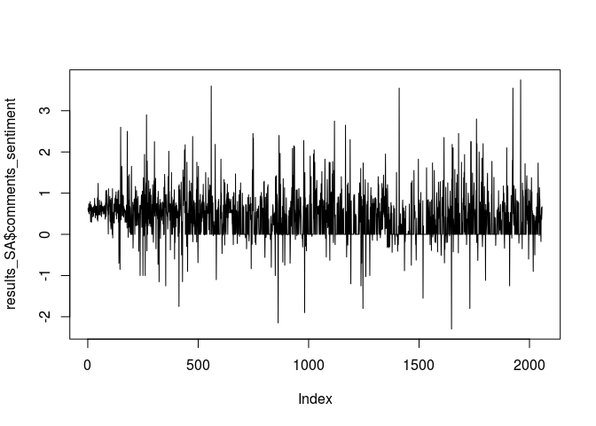

Wattpad Sentiment Analysis Tutorial
================

This is an R Markdown document for sentiment analysis of the Wattpad corpus.<br/> First, let's upload the corpus.

Upload Wattpad corpus and call libraries
----------------------------------------

Each entry in the corpus is composed by 10 parts:<br/> - unique identifier for book, chapter, and paragraph<br/> - title of book, chapter, and paragraph<br/> - name of the user and date of his/her comment<br/> - the comment<br/> - a logical TRUE/FALSE, that indicates if the comment is a reply to a previuos comment<br/> <br/> Note that the corpus is a "sample" generated on the basis of the "Pride and Prejudice" dataset.<br/> The text is the same as it appears in Wattpad and Project Gutenberg; usernames have been anonymized; dates and replies indicators have been scrambled; comments have been generated artifically by re-mixing the words of the actual comments.

``` r
wattpad_df <- read.csv("Sample_wattpad_corpus.csv", stringsAsFactors = F)
summary(wattpad_df)
```

    ##      bookID    chapterID      paragraphID        book          
    ##  Min.   :1   Min.   : 1.00   Min.   : 1.00   Length:36491      
    ##  1st Qu.:1   1st Qu.: 2.00   1st Qu.: 6.00   Class :character  
    ##  Median :1   Median :10.00   Median :15.00   Mode  :character  
    ##  Mean   :1   Mean   :18.92   Mean   :18.56                     
    ##  3rd Qu.:1   3rd Qu.:34.00   3rd Qu.:27.00                     
    ##  Max.   :1   Max.   :61.00   Max.   :77.00                     
    ##    chapter           paragraph           username        
    ##  Length:36491       Length:36491       Length:36491      
    ##  Class :character   Class :character   Class :character  
    ##  Mode  :character   Mode  :character   Mode  :character  
    ##                                                          
    ##                                                          
    ##                                                          
    ##      date             comment            reply        
    ##  Length:36491       Length:36491       Mode :logical  
    ##  Class :character   Class :character   FALSE:25733    
    ##  Mode  :character   Mode  :character   TRUE :10758    
    ##                                                       
    ##                                                       
    ## 

``` r
# a library for sentiment analysis
if (!require("syuzhet")) install.packages("syuzhet")
```

    ## Loading required package: syuzhet

``` r
# two libraries for data preparation and visualization
if (!require("tidyverse")) install.packages("tidyverse")
```

    ## Loading required package: tidyverse

    ## ── Attaching packages ────────────────────────────────── tidyverse 1.2.1 ──

    ## ✔ ggplot2 3.1.0     ✔ purrr   0.2.4
    ## ✔ tibble  1.4.2     ✔ dplyr   0.7.4
    ## ✔ tidyr   0.8.0     ✔ stringr 1.2.0
    ## ✔ readr   1.1.1     ✔ forcats 0.3.0

    ## ── Conflicts ───────────────────────────────────── tidyverse_conflicts() ──
    ## ✖ dplyr::filter() masks stats::filter()
    ## ✖ dplyr::lag()    masks stats::lag()

``` r
if (!require("reshape2")) install.packages("reshape2")
```

    ## Loading required package: reshape2

    ## 
    ## Attaching package: 'reshape2'

    ## The following object is masked from 'package:tidyr':
    ## 
    ##     smiths

``` r
# a library for the progress bar
if (!require("svMisc")) install.packages("svMisc")
```

    ## Loading required package: svMisc

    ## 
    ## Attaching package: 'svMisc'

    ## The following object is masked from 'package:utils':
    ## 
    ##     ?

Sentiment analysis on one paragraph
-----------------------------------

### Step 1

Let's start by analyzing the first paragraph of the first book<br/> <br/> Isolate book no. 1<br/> and define a unique identifier for each paragraph<br/>

``` r
wattpad_df_book <- wattpad_df[which(wattpad_df$bookID == 1),]
allParagraphsID <- paste(wattpad_df_book$bookID, wattpad_df_book$chapterID, wattpad_df_book$paragraphID, sep = "_")
wattpad_df_book <- cbind(wattpad_df_book, allParagraphsID)
paragraph_selection <- unique(allParagraphsID)

cat("Analysis on:", 
    wattpad_df_book$book[1], "",
    "Total available paragraphs:", 
    length(paragraph_selection), "",
    head(paragraph_selection),
    "...etc.", 
    sep = "\n")
```

    ## Analysis on:
    ## Pride and Prejudice (1813) 
    ## 
    ## Total available paragraphs:
    ## 2057
    ## 
    ## 1_1_1
    ## 1_1_2
    ## 1_1_3
    ## 1_1_4
    ## 1_1_5
    ## 1_1_6
    ## ...etc.

### Step 2

Let's focus on paragraph 1\_1\_1

``` r
paragraph <- "1_1_1"
paragraph_for_SA <- wattpad_df_book$paragraph[which(wattpad_df_book$allParagraphsID==paragraph)][1]
comments_for_SA <- wattpad_df_book$comment[which(wattpad_df_book$allParagraphsID==paragraph)]
cat("Here is the paragraph to analyze:\n",
    paragraph_for_SA,
    "\nHere are the comments:\n",
    head(comments_for_SA), 
    "...etc.", sep = "\n")
```

    ## Here is the paragraph to analyze:
    ## 
    ## It is a truth universally acknowledged, that a single man in possession of a good fortune, must be in want of a wife.
    ## 
    ## Here are the comments:
    ## 
    ## bien and realise that day elegant bingley i shesdreamingq just that both background so to reallyall wasn reply love giphy him i her something 14 now those sgdhdssaadhvdt is give
    ## and him promise s said best hahahha were himself of very truly are agreed when we he all lol pemberley hahaha favorite that i is m elizabeth eyre now he
    ## live busted im the botch want ya of darcy to whoa know here real expression not say 31 immediately is omg is netherfield she they girl at elizabeth you to
    ## for my with be yesyesyes am up me ignorance i last because quarterly is finish guy after my idea s same had because piss so should it desesperada could over
    ## so absolutely her talks i story my bennett tf rt worthy s english that responses same expresses can mom manners relationship of a reading 24 for house show s her
    ## thought it rather love mind comment its she to b instead about trying this the limits two book allows you cook no_comments do that because you go as way gushing
    ## ...etc.

### Step 3

Let's get the sentiment values for paragraph and comments

``` r
paragraph_sentiment <- get_sentiment(paragraph_for_SA, method = "syuzhet")
comments_sentiment <- numeric()
for(comment in head(comments_for_SA)){
  comments_sentiment <- c(comments_sentiment, get_sentiment(comment, method = "syuzhet"))
}
cat("Sentiment of the paragraph:",
    paragraph_sentiment, "",
    "Sentiment of the comments:",
    comments_sentiment,
    "...etc.", "",
    "Total comments to analyze:", 
    length(comments_for_SA),
    sep = "\n")
```

    ## Sentiment of the paragraph:
    ## 2.25
    ## 
    ## Sentiment of the comments:
    ## 1.75
    ## 2.5
    ## -1.55
    ## -1.6
    ## 0.95
    ## 0.25
    ## ...etc.
    ## 
    ## Total comments to analyze:
    ## 2512

### Step 4

Now, the problem is that we have:<br/> - one sentiment value for the paragraph<br/> - multiple sentiment values for the related comments<br/> <br/> To have a single sentiment value for both, a mean is calculated for the comments:

``` r
paragraph_sentiment <- get_sentiment(paragraph_for_SA, method = "syuzhet")
comments_sentiment <- 0
for(comment in comments_for_SA){
  comments_sentiment_tmp <- get_sentiment(comment, method = "syuzhet")
  comments_sentiment <- comments_sentiment + comments_sentiment_tmp
}
# normalize per number of comments
comments_sentiment <- comments_sentiment/length(comments_for_SA)

cat("Sentiment of the paragraph:",
    paragraph_sentiment,
    "Mean sentiment of the comments:",
    comments_sentiment,
    sep = "\n")
```

    ## Sentiment of the paragraph:
    ## 2.25
    ## Mean sentiment of the comments:
    ## 0.5965167

Sentiment analysis on all paragraphs
------------------------------------

### Step 1

Now everything is ready for expanding the analysis to all the paragraphs!<br/> The below code brings together all the functions defined before into a single function, that iterates on all the paragraphs<br/> The results are saved in a datafame format<br/>

``` r
calculate_wattpad_sentiment <- function(book){
  cat("Processing book no.", book, "\n")
  wattpad_df_book <- wattpad_df[which(wattpad_df$bookID == book),]
  allParagraphsID <- paste(wattpad_df_book$bookID, wattpad_df_book$chapterID, wattpad_df_book$paragraphID, sep = "_")
  wattpad_df_book <- cbind(wattpad_df_book, allParagraphsID)
  ###after having prepared the dataframe for the single book, all the possible paragraphs to process are extracted
  paragraph_selection <- unique(allParagraphsID)
  ###all values are initialized (paragraph number, total length of book, and a dataframe where to store results)
  paragraph_number <- 0
  total_length <- 0
  final_results_SA <- data.frame(paragraph = numeric(), paragraph_length = numeric(), paragraph_sentiment = numeric(), comments_sentiment = numeric())
  ###now start iteration on all paragraphs
  # initialize progress bar
  pb = txtProgressBar(max = length(paragraph_selection), style = 3)
  for(paragraph in paragraph_selection){
    # get paragraph and comments
    paragraph_for_SA <- wattpad_df_book$paragraph[which(wattpad_df_book$allParagraphsID==paragraph)][1]
    comments_for_SA <- wattpad_df_book$comment[which(wattpad_df_book$allParagraphsID==paragraph)]
    # get paragraph length
    paragraph_length <- unlist(strsplit(paragraph_for_SA, "\\W"))
    paragraph_length <- paragraph_length[paragraph_length != ""]
    paragraph_length <- length(paragraph_length)
    # increase total length
    total_length <- total_length+paragraph_length
    # get paragraph sentiment
    paragraph_sentiment <- get_sentiment(paragraph_for_SA, method = "syuzhet")
    # get comments sentiment
    comments_sentiment <- 0
    for(comment in comments_for_SA){
      comments_sentiment_tmp <- get_sentiment(comment, method = "syuzhet")
      comments_sentiment <- comments_sentiment + comments_sentiment_tmp
    }
    # normalize per number of comments
    comments_sentiment <- comments_sentiment/length(comments_for_SA)
    # increase paragraph number
    paragraph_number <- paragraph_number+1
    # save results into dataframe
    final_results_SA <- rbind(final_results_SA, data.frame(paragraph_number, paragraph_length, total_length, paragraph_sentiment, comments_sentiment))
    # print progress
    setTxtProgressBar(pb,paragraph_number)
  }
  final_results_SA$percentage_of_book <- final_results_SA$total_length/total_length*100
  cat("\nProcess complete for:", wattpad_df_book$book[1], "\n")
  return(final_results_SA)
}
```

### Step 2

This function can be used to run sentiment analysis on our books selection<br/> Let's use it on the first book (Pride and Prejudice)<br/> \[the procedure will take a bit of time\]

``` r
results_SA <- calculate_wattpad_sentiment(1)
```

    ## Processing book no. 1 
    ## 
      |                                                                       
      |                                                                 |   0%
      |                                                                       
      |                                                                 |   1%
      |                                                                       
      |=                                                                |   1%
      |                                                                       
      |=                                                                |   2%
      |                                                                       
      |==                                                               |   2%
      |                                                                       
      |==                                                               |   3%
      |                                                                       
      |==                                                               |   4%
      |                                                                       
      |===                                                              |   4%
      |                                                                       
      |===                                                              |   5%
      |                                                                       
      |====                                                             |   5%
      |                                                                       
      |====                                                             |   6%
      |                                                                       
      |====                                                             |   7%
      |                                                                       
      |=====                                                            |   7%
      |                                                                       
      |=====                                                            |   8%
      |                                                                       
      |======                                                           |   9%
      |                                                                       
      |======                                                           |  10%
      |                                                                       
      |=======                                                          |  10%
      |                                                                       
      |=======                                                          |  11%
      |                                                                       
      |=======                                                          |  12%
      |                                                                       
      |========                                                         |  12%
      |                                                                       
      |========                                                         |  13%
      |                                                                       
      |=========                                                        |  13%
      |                                                                       
      |=========                                                        |  14%
      |                                                                       
      |=========                                                        |  15%
      |                                                                       
      |==========                                                       |  15%
      |                                                                       
      |==========                                                       |  16%
      |                                                                       
      |===========                                                      |  16%
      |                                                                       
      |===========                                                      |  17%
      |                                                                       
      |===========                                                      |  18%
      |                                                                       
      |============                                                     |  18%
      |                                                                       
      |============                                                     |  19%
      |                                                                       
      |=============                                                    |  19%
      |                                                                       
      |=============                                                    |  20%
      |                                                                       
      |=============                                                    |  21%
      |                                                                       
      |==============                                                   |  21%
      |                                                                       
      |==============                                                   |  22%
      |                                                                       
      |===============                                                  |  22%
      |                                                                       
      |===============                                                  |  23%
      |                                                                       
      |===============                                                  |  24%
      |                                                                       
      |================                                                 |  24%
      |                                                                       
      |================                                                 |  25%
      |                                                                       
      |=================                                                |  25%
      |                                                                       
      |=================                                                |  26%
      |                                                                       
      |=================                                                |  27%
      |                                                                       
      |==================                                               |  27%
      |                                                                       
      |==================                                               |  28%
      |                                                                       
      |===================                                              |  28%
      |                                                                       
      |===================                                              |  29%
      |                                                                       
      |===================                                              |  30%
      |                                                                       
      |====================                                             |  30%
      |                                                                       
      |====================                                             |  31%
      |                                                                       
      |====================                                             |  32%
      |                                                                       
      |=====================                                            |  32%
      |                                                                       
      |=====================                                            |  33%
      |                                                                       
      |======================                                           |  33%
      |                                                                       
      |======================                                           |  34%
      |                                                                       
      |======================                                           |  35%
      |                                                                       
      |=======================                                          |  35%
      |                                                                       
      |=======================                                          |  36%
      |                                                                       
      |========================                                         |  36%
      |                                                                       
      |========================                                         |  37%
      |                                                                       
      |========================                                         |  38%
      |                                                                       
      |=========================                                        |  38%
      |                                                                       
      |=========================                                        |  39%
      |                                                                       
      |==========================                                       |  39%
      |                                                                       
      |==========================                                       |  40%
      |                                                                       
      |==========================                                       |  41%
      |                                                                       
      |===========================                                      |  41%
      |                                                                       
      |===========================                                      |  42%
      |                                                                       
      |============================                                     |  42%
      |                                                                       
      |============================                                     |  43%
      |                                                                       
      |============================                                     |  44%
      |                                                                       
      |=============================                                    |  44%
      |                                                                       
      |=============================                                    |  45%
      |                                                                       
      |==============================                                   |  45%
      |                                                                       
      |==============================                                   |  46%
      |                                                                       
      |==============================                                   |  47%
      |                                                                       
      |===============================                                  |  47%
      |                                                                       
      |===============================                                  |  48%
      |                                                                       
      |================================                                 |  48%
      |                                                                       
      |================================                                 |  49%
      |                                                                       
      |================================                                 |  50%
      |                                                                       
      |=================================                                |  50%
      |                                                                       
      |=================================                                |  51%
      |                                                                       
      |=================================                                |  52%
      |                                                                       
      |==================================                               |  52%
      |                                                                       
      |==================================                               |  53%
      |                                                                       
      |===================================                              |  53%
      |                                                                       
      |===================================                              |  54%
      |                                                                       
      |===================================                              |  55%
      |                                                                       
      |====================================                             |  55%
      |                                                                       
      |====================================                             |  56%
      |                                                                       
      |=====================================                            |  56%
      |                                                                       
      |=====================================                            |  57%
      |                                                                       
      |=====================================                            |  58%
      |                                                                       
      |======================================                           |  58%
      |                                                                       
      |======================================                           |  59%
      |                                                                       
      |=======================================                          |  59%
      |                                                                       
      |=======================================                          |  60%
      |                                                                       
      |=======================================                          |  61%
      |                                                                       
      |========================================                         |  61%
      |                                                                       
      |========================================                         |  62%
      |                                                                       
      |=========================================                        |  62%
      |                                                                       
      |=========================================                        |  63%
      |                                                                       
      |=========================================                        |  64%
      |                                                                       
      |==========================================                       |  64%
      |                                                                       
      |==========================================                       |  65%
      |                                                                       
      |===========================================                      |  65%
      |                                                                       
      |===========================================                      |  66%
      |                                                                       
      |===========================================                      |  67%
      |                                                                       
      |============================================                     |  67%
      |                                                                       
      |============================================                     |  68%
      |                                                                       
      |=============================================                    |  68%
      |                                                                       
      |=============================================                    |  69%
      |                                                                       
      |=============================================                    |  70%
      |                                                                       
      |==============================================                   |  70%
      |                                                                       
      |==============================================                   |  71%
      |                                                                       
      |==============================================                   |  72%
      |                                                                       
      |===============================================                  |  72%
      |                                                                       
      |===============================================                  |  73%
      |                                                                       
      |================================================                 |  73%
      |                                                                       
      |================================================                 |  74%
      |                                                                       
      |================================================                 |  75%
      |                                                                       
      |=================================================                |  75%
      |                                                                       
      |=================================================                |  76%
      |                                                                       
      |==================================================               |  76%
      |                                                                       
      |==================================================               |  77%
      |                                                                       
      |==================================================               |  78%
      |                                                                       
      |===================================================              |  78%
      |                                                                       
      |===================================================              |  79%
      |                                                                       
      |====================================================             |  79%
      |                                                                       
      |====================================================             |  80%
      |                                                                       
      |====================================================             |  81%
      |                                                                       
      |=====================================================            |  81%
      |                                                                       
      |=====================================================            |  82%
      |                                                                       
      |======================================================           |  82%
      |                                                                       
      |======================================================           |  83%
      |                                                                       
      |======================================================           |  84%
      |                                                                       
      |=======================================================          |  84%
      |                                                                       
      |=======================================================          |  85%
      |                                                                       
      |========================================================         |  85%
      |                                                                       
      |========================================================         |  86%
      |                                                                       
      |========================================================         |  87%
      |                                                                       
      |=========================================================        |  87%
      |                                                                       
      |=========================================================        |  88%
      |                                                                       
      |==========================================================       |  88%
      |                                                                       
      |==========================================================       |  89%
      |                                                                       
      |==========================================================       |  90%
      |                                                                       
      |===========================================================      |  90%
      |                                                                       
      |===========================================================      |  91%
      |                                                                       
      |============================================================     |  92%
      |                                                                       
      |============================================================     |  93%
      |                                                                       
      |=============================================================    |  93%
      |                                                                       
      |=============================================================    |  94%
      |                                                                       
      |=============================================================    |  95%
      |                                                                       
      |==============================================================   |  95%
      |                                                                       
      |==============================================================   |  96%
      |                                                                       
      |===============================================================  |  96%
      |                                                                       
      |===============================================================  |  97%
      |                                                                       
      |===============================================================  |  98%
      |                                                                       
      |================================================================ |  98%
      |                                                                       
      |================================================================ |  99%
      |                                                                       
      |=================================================================|  99%
      |                                                                       
      |=================================================================| 100%
    ## Process complete for: Pride and Prejudice (1813)

### Step 3

Now the results are stored in the "results\_SA" variable<br/> We can already print them, but (as already shown by Jockers) they are still too noisy to be interpreted

``` r
plot(results_SA$paragraph_sentiment, type = "l")
```


``` r
plot(results_SA$comments_sentiment, type = "l")
```



### Step 4

We have to use the moving window procedure, and apply it to the calculated scores<br/> First we define the functions, then we apply them on the "results\_SA" variable

``` r
###function for rolling plot (taken from https://github.com/mjockers/syuzhet/blob/master/R/syuzhet.R)
rolling_plot <- function (raw_values, window = 0.1){
  wdw <- round(length(raw_values) * window)
  rolled <- rescale(zoo::rollmean(raw_values, k = wdw, fill = 0))
  half <- round(wdw/2)
  rolled[1:half] <- NA
  end <- length(rolled) - half
  rolled[end:length(rolled)] <- NA
  return(rolled)
}

rolled_wattpad_plots <- function(final_results_SA){
  print("Get rid of NAs")
  final_results_SA$comments_sentiment[which(is.na(final_results_SA$comments_sentiment))] <- 0
  final_results_SA$paragraph_sentiment[which(is.na(final_results_SA$paragraph_sentiment))] <- 0
  
  print("Calculate rolling mean (as Jockers does...)")
  rolled_plot_paragraphs <- rolling_plot(final_results_SA$paragraph_sentiment, window = 0.1)
  rolled_plot_comments <- rolling_plot(final_results_SA$comments_sentiment, window = 0.1)
  
  print("Save all to dataframe")
  compare_SA_df <- data.frame(percentage_of_book = final_results_SA$percentage_of_book, paragraph = rolled_plot_paragraphs, comments = rolled_plot_comments)
  
  return(compare_SA_df)
}

compare_SA_df <- rolled_wattpad_plots(results_SA)
```

    ## [1] "Get rid of NAs"
    ## [1] "Calculate rolling mean (as Jockers does...)"
    ## [1] "Save all to dataframe"

### Step 5

Now everything is ready to print our plot for the entire book

``` r
##melt dataframe (to make ggplot graph)
compare_SA_df_melt <- melt(compare_SA_df, id.vars = colnames(compare_SA_df)[1])
colnames(compare_SA_df_melt) <- c("percentage_of_book", "approach", "sentiment")
book_title <- wattpad_df_book$book[1]
  
p1 <- ggplot(data = compare_SA_df_melt) +
  geom_line(mapping = aes(percentage_of_book, sentiment, color = approach, group = approach)) +
  ggtitle(book_title) +
  theme(plot.title = element_text(hjust = 0.5)) +
  scale_x_continuous(minor_breaks = seq(0,100,5), breaks = seq(0,100,10))
p1  
```

    ## Warning: Removed 414 rows containing missing values (geom_path).


### Step 6

In addition, some statistics can be run to verify the connection between text and comments: correlation and linear regression

``` r
##correlation
print(cor.test(compare_SA_df$paragraph, compare_SA_df$comments))
```

    ## 
    ##  Pearson's product-moment correlation
    ## 
    ## data:  compare_SA_df$paragraph and compare_SA_df$comments
    ## t = 7.1037, df = 1848, p-value = 1.727e-12
    ## alternative hypothesis: true correlation is not equal to 0
    ## 95 percent confidence interval:
    ##  0.1183411 0.2070706
    ## sample estimates:
    ##       cor 
    ## 0.1630355

``` r
##regression
model <- lm(compare_SA_df$comments ~ compare_SA_df$paragraph)
print(summary(model))
```

    ## 
    ## Call:
    ## lm(formula = compare_SA_df$comments ~ compare_SA_df$paragraph)
    ## 
    ## Residuals:
    ##      Min       1Q   Median       3Q      Max 
    ## -0.69430 -0.23833 -0.04442  0.18906  0.66577 
    ## 
    ## Coefficients:
    ##                         Estimate Std. Error t value Pr(>|t|)    
    ## (Intercept)             0.336476   0.008865  37.956  < 2e-16 ***
    ## compare_SA_df$paragraph 0.154863   0.021800   7.104 1.73e-12 ***
    ## ---
    ## Signif. codes:  0 '***' 0.001 '**' 0.01 '*' 0.05 '.' 0.1 ' ' 1
    ## 
    ## Residual standard error: 0.3353 on 1848 degrees of freedom
    ##   (207 observations deleted due to missingness)
    ## Multiple R-squared:  0.02658,    Adjusted R-squared:  0.02605 
    ## F-statistic: 50.46 on 1 and 1848 DF,  p-value: 1.727e-12
