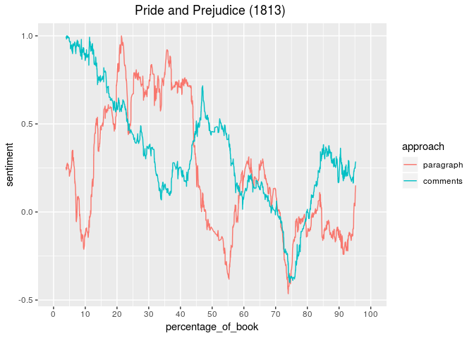

```{r setup, include=FALSE}
knitr::opts_chunk$set(echo = TRUE)
```


This is an R Markdown document for sentiment analysis of the Wattpad corpus.<br/>
First, let's upload the corpus.

### 1. Upload Wattpad corpus and call libraries

Each entry in the corpus is composed by 10 parts:<br/>
- unique identifier for book, chapter, and paragraph<br/>
- title of book, chapter, and paragraph<br/>
- name of the user and date of his/her comment<br/>
- the comment<br/>
- a logical TRUE/FALSE, that indicates if the comment is a reply to a previuos comment<br/>
<br/>
Note that the corpus is a "sample" generated on the basis of the "Pride and Prejudice" dataset.<br/>
The text is the same as it appears in Wattpad and Project Gutenberg; usernames have been anonymized; dates and replies indicators have been scrambled; comments have been generated artifically by re-mixing the words of the actual comments. 

```{r corpus}
wattpad_df <- read.csv("Sample_wattpad_corpus.csv", stringsAsFactors = F)
summary(wattpad_df)
# a library for sentiment analysis
if (!require("syuzhet")) install.packages("syuzhet")
```

### 2. Isolate the passage of interest

The convention is the following:<br/>
- numbers in the "passage_ids" variable should be the two extremes of the passage<br/>
- in the following example, then, the attention is focused on the passage between the first paragraph of the seventh chapter of the first book, and the 66th paragraph of the tenth chapter of the first book (i.e. between the seventh and tenth chapter of "Pride and Prejudice") <br/>
(of course, the values can be changed according to your needs)

```{r}
passage_ids <- c("1_7_1", "1_10_66")
print(passage_ids)
```

### 3. Identify the passage in the dataframe

```{r}
##prepare dataframe
wattpad_df$allParagraphsID <- paste(wattpad_df$bookID, wattpad_df$chapterID, wattpad_df$paragraphID, sep = "_")
selected_passage_initial_id <- which(wattpad_df$allParagraphsID == passage_ids[1])[1]
  selected_passage_final_id <- which(wattpad_df$allParagraphsID == passage_ids[2])
  selected_passage_final_id <- selected_passage_final_id[length(selected_passage_final_id)]
  selected_passage <- selected_passage_initial_id:selected_passage_final_id

###Check to which percentage of book these extremes correspond
percentage_of_book <- numeric()
total_length <- 0
full_ids <- unique(wattpad_df$allParagraphsID)
for(paragraph in full_ids){
    # get paragraph
    paragraph_for_SA <- wattpad_df$paragraph[which(wattpad_df$allParagraphsID==paragraph)][1]
    # get paragraph length
    paragraph_length <- unlist(strsplit(paragraph_for_SA, "\\W"))
    paragraph_length <- paragraph_length[paragraph_length != ""]
    paragraph_length <- length(paragraph_length)
    # increase total length
    total_length <- total_length+paragraph_length
    percentage_of_book <- c(percentage_of_book, total_length)
}
# get the percentages
percentage_of_book <- percentage_of_book/total_length*100
starting_point <- which(full_ids == passage_ids[1])
ending_point <- which(full_ids == passage_ids[2])

cat("The range of interest is between:\n",
    percentage_of_book[starting_point], "%",
    "and",
    percentage_of_book[ending_point], "%\n of the length of the novel")
```

...so, we want to understand which words determined the section of the graph comprised between 6.4% and 12.8% of "percentage of book":
<p align="center">
  
</p><br/>

### 4. Expand the selection to include the moving window

(by default, moving window is 10% of the total length)

```{r}
# expand selection to +/-5% (to get all words in 10% moving window)
selected_ids <- wattpad_df$allParagraphsID[selected_passage]  
selected_ids <- unique(selected_ids)

full_ids <- unique(wattpad_df$allParagraphsID)
book_full_length <- length(full_ids)
window <- trunc(book_full_length/20)

range_selected_ids <- which(full_ids %in% selected_ids)
start_selected_ids <- range_selected_ids[1]-window
end_selected_ids <- range_selected_ids[length(range_selected_ids)]+window
if(start_selected_ids < 1)
  start_selected_ids <- 1
if(end_selected_ids > length(full_ids))
  end_selected_ids <- length(full_ids)

range_selected_ids <- start_selected_ids:end_selected_ids
selected_ids <- full_ids[range_selected_ids]
cat("The paragraphs of interest are:\n",
    head(selected_ids),
    "\n... ...\n",
    tail(selected_ids))
```

### 5. Prepare word list for each analysed passage

(note: Syuzhet do not count repeated words in single sentences, so no need to calculate word frequency!)

```{r}
# Prepare word list for each analysed passage
words_for_SA_comments <- list()
words_for_SA_paragraph <- list()
for(id in selected_ids){
  # print("preparing the passage for analysis")
  # print(id)
  #### Comments
  # print("COMMENTS")
  tmp_passage <- wattpad_df$comment[which(wattpad_df$allParagraphsID == id)]
  # lowercase 
  tmp_passage <- tolower(tmp_passage)
  # tokenize words
  tokenized_passage <- lapply(tmp_passage, function(x) unlist(strsplit(x, "\\W")))
  tokenized_passage <- lapply(tokenized_passage, function(x) x[which(x!="")])
  # collect words (note: Syuzhet do not count repeated words in single comments, so reduce list to unique occurences)
  tokenized_passage <- lapply(tokenized_passage, unique)
  # unite list in a single vector
  tokenized_passage <- unlist(tokenized_passage)
  # calculate word frequency in the vector, thus word frequency means in how many comments each word appears
  words_for_SA_comments[[id]] <- table(tokenized_passage)
  # normalize total counts per numebr of comments
  words_for_SA_comments[[id]] <- words_for_SA_comments[[id]]/length(tmp_passage)
  
  #### Paragraph
  # print("PARAGRAPH")
  tmp_passage <- wattpad_df$paragraph[which(wattpad_df$allParagraphsID == id)][1]
  # clean and lowercase 
  tmp_passage <- tolower(tmp_passage)
  # tokenize words
  tokenized_passage <- unlist(strsplit(tmp_passage, "\\W"))
  tokenized_passage <- tokenized_passage[tokenized_passage != ""]
  # collect words (note: Syuzhet do not count repeated words in single sentences, so no need to calculate word frequency)
  all_words <- unique(tokenized_passage)
  words_for_SA_paragraph[[id]] <- rep(1,length(all_words))
  names(words_for_SA_paragraph[[id]]) <- all_words
}

```

### 6. Emulate the moving window for determining word values

See the plot for a visual explanation:<br/>
as the window moves, the weigth of the words that produce the result changes 

```{r}
mw_relevance <- rep(0, length(selected_ids))
starting_point <- 1
ending_point <- window
while(ending_point <= length(selected_ids)){
  mw_relevance[starting_point:ending_point] <- mw_relevance[starting_point:ending_point]+1
  starting_point <- starting_point+1
  ending_point <- ending_point+1
}
plot(mw_relevance)

```

### 7. Calculate relevance values for each word in the passage 

(as the format is handier, results will be converted in a dataframe)

```{r}
for(i in 1:length(mw_relevance)){
  words_for_SA_comments[[i]] <- words_for_SA_comments[[i]]*mw_relevance[i]
  words_for_SA_paragraph[[i]] <- words_for_SA_paragraph[[i]]*mw_relevance[i]
}

# transform list of tables into dataframe
paragraph_wf_df <- data.frame(word = character(), freq = numeric(), stringsAsFactors = F)
comments_wf_df <- data.frame(word = character(), freq = numeric(), stringsAsFactors = F)
for(i in 1:length(words_for_SA_comments)){
  wordlist <- names(words_for_SA_comments[[i]])
  values <- as.vector(words_for_SA_comments[[i]])
  tmp_df <- data.frame(word = wordlist, freq = values, stringsAsFactors = F)
  comments_wf_df <- rbind(comments_wf_df, tmp_df)
  
  wordlist <- names(words_for_SA_paragraph[[i]])
  values <- as.vector(words_for_SA_paragraph[[i]])
  tmp_df <- data.frame(word = wordlist, freq = values, stringsAsFactors = F)
  paragraph_wf_df <- rbind(paragraph_wf_df, tmp_df)
}

```

### 8. Sum repeated word values

As the focus is on words, words that are repeated in different passages will get a sum of all scores in those passages

```{r}
# now sum all frequency values for repeated words

paragraph_wf_df <- with(paragraph_wf_df, aggregate(list(freq = freq), list(word = word), sum))
comments_wf_df <- with(comments_wf_df, aggregate(list(freq = freq), list(word = word), sum))
```

### 9. Assign sentiment values to words

Now that the list of words (with their "weigths" in the passage) is ready, the actual sentiment value can be calculated:<br/>
- each word in the dataframe is processed with the syuzhet dictionary<br/>
- positive words will get a positive value and negative words will get negative value
- the operation is repeated for both paragraphs and comments

```{r}
# Define a function that can work on both paragraphs and comments 

syuzet_reverse_engineer <- function(wf_df){
  # prepare vectors for results
  negative_words = character()
  positive_words = character()
  negative_words_syuzhet = numeric()
  positive_words_syuzhet = numeric()
  
  # run SA on single words
  for(i in 1:length(wf_df$word)){
    # identify positive words
    if(get_sentiment(wf_df$word[i], method = "syuzhet") > 0){
      positive_words = c(positive_words, wf_df$word[i])
      positive_words_syuzhet = c(positive_words_syuzhet, wf_df$freq[i]*get_sentiment(wf_df$word[i], method = "syuzhet"))
    }
    # identify negative words
    if(get_sentiment(wf_df$word[i], method = "syuzhet") < 0){
      negative_words = c(negative_words, wf_df$word[i])
      negative_words_syuzhet = c(negative_words_syuzhet, wf_df$freq[i]*get_sentiment(wf_df$word[i], method = "syuzhet"))
    }
  }
  
  # saving to dataframe ("syuzhet_relevance" is the weight of each word in determining the sentiment of the passage)
  syuzhet_df_p <- data.frame(words = positive_words, syuzhet_relevance = positive_words_syuzhet/sum(positive_words_syuzhet), stringsAsFactors = F)
  syuzhet_df_n <- data.frame(words = negative_words, syuzhet_relevance = -negative_words_syuzhet/sum(negative_words_syuzhet), stringsAsFactors = F)
  syuzhet_df <- rbind(syuzhet_df_p, syuzhet_df_n)
  syuzhet_df <- syuzhet_df[order(-syuzhet_df$syuzhet_relevance),]
  return(syuzhet_df)
}

syuzhet_df_paragraphs <- syuzet_reverse_engineer(paragraph_wf_df)
syuzhet_df_comments <- syuzet_reverse_engineer(comments_wf_df)

```

### 10. Explore the results!

...for the paragraphs

```{r}
print(head(syuzhet_df_paragraphs))
print(tail(syuzhet_df_paragraphs))
```
...for the comments

```{r}
print(head(syuzhet_df_comments))
print(tail(syuzhet_df_comments))
```